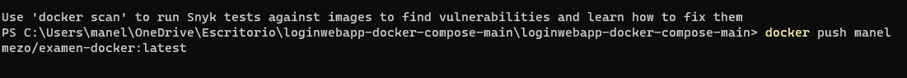

# docker-examen
Para empezar con el proyecto hay que primero abrir tanto la terminal como docker desktop

Hay que esperar a que inicie. Una vez iniciado hay que revisar el documento del dockercompose.yml

Ver que las configuraciones están correctas y los puertos bien establecidos. Una vez confirmado que el docker compose está bien y sus versiones son correctas, iniciamos la construcción de la imagen de la siguiente manera.

Con este comando empezará a montarse la imagen y no debería dar ningún error

Ahora comprobemos que de verdad se ha montado correctamente. Primero entraremos en localhost8081 que es el de php y vemos que va perfectamente

Iniciamos sesión en el usuario Y confirmamos que la base de datos se ha formado correctamente.

Ahora vamos a visualizar la página web con el  Recordar poner el mismo nombre del archivo

Y vemos que se visualiza correctamente. Al entrar pero, sale el siguiente error

Para arreglarlo hay que ir a php de nuevo y crear una nueva tabla de la siguiente forma

Y darle a guardar tras poner esos datos

Ahora funciona (nota, no poner un correo electrónico entero, sino sale el siguiente mensaje)

Comprobamos que se ha generado correctamente.

Apagamos la imagen y lo subimos a docker. Para apagarlo hacemos lo siguiente

Y se cerrará solo sin ningún problema

Ahora solo falta subir el proyecto a DockerHub, para hacerlo debemos realizar lo siguiente

Ponemos el comando docker build -t (nombreusuario/nombreimagen)

Una vez realizado el docker build, debería salir el FINISHED ese blanco indicando que todo ha ido bien. Ahora solo faltaría el push y lo haremos de la siguiente manera.

docker push (nombreusuario/nombreimagen)

Y con eso ha finalizado de subirse al dockerhub 

Enlace al dockerhub donde se puede descargar la imagen:

[https://hub.docker.com/repository/docker/manelmezo/examen-docker](https://www.google.com/url?q=https://hub.docker.com/repository/docker/manelmezo/examen-docker&sa=D&source=editors&ust=1654882181106876&usg=AOvVaw2owfbC_tp8s61cy7tqHGiu)
